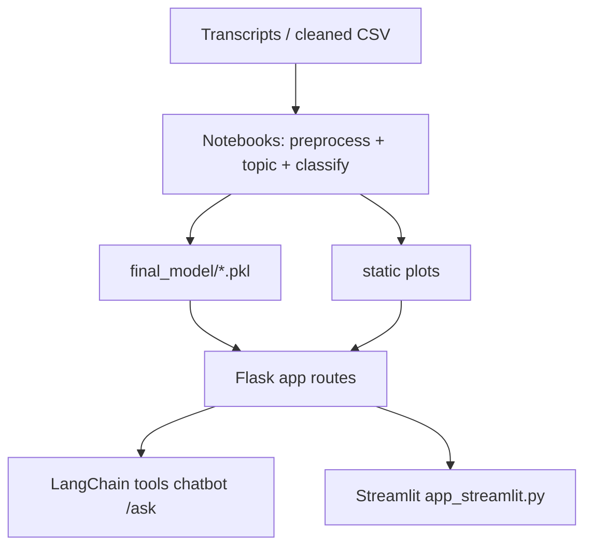
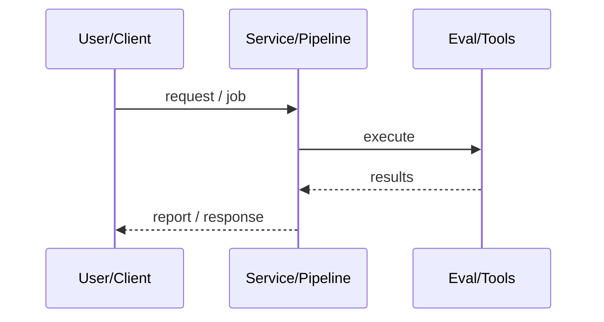
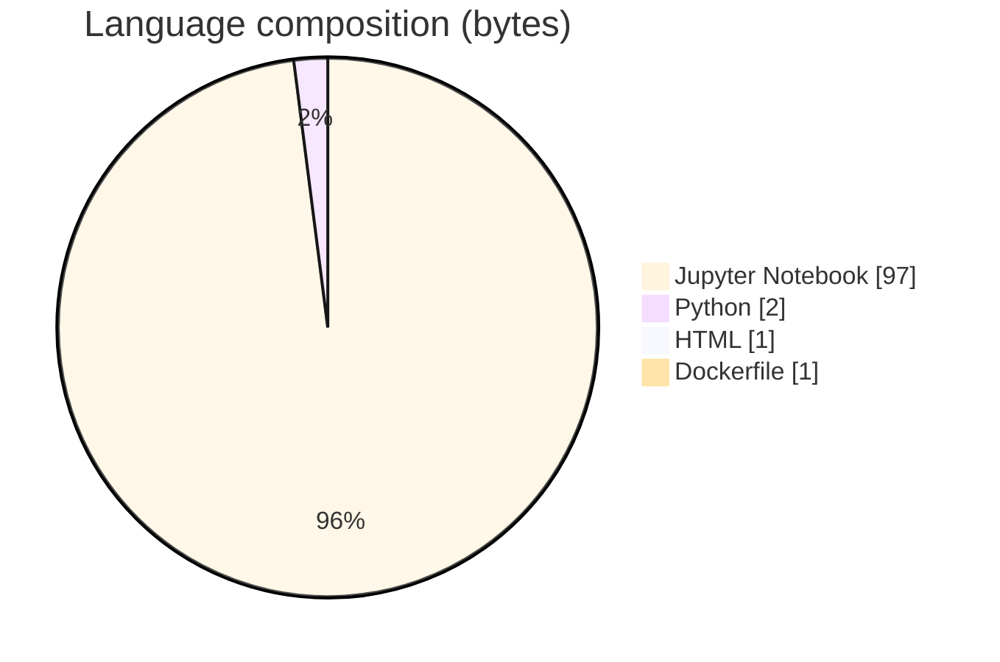

# Emotion Insight Mining Framework for Podcasts

### Mine Lex Fridman-style podcast transcripts for topics, classifications, and chat Q&A.

[](https://github.com/ArchanaChetan07/AI-Explains-What-They-Meant-An-Emotion-Insight-Mining-Framework-for-Podcasts)
[](https://github.com/ArchanaChetan07/AI-Explains-What-They-Meant-An-Emotion-Insight-Mining-Framework-for-Podcasts)
[](https://github.com/ArchanaChetan07/AI-Explains-What-They-Meant-An-Emotion-Insight-Mining-Framework-for-Podcasts)
[](https://github.com/ArchanaChetan07/AI-Explains-What-They-Meant-An-Emotion-Insight-Mining-Framework-for-Podcasts/actions)

---

## Overview

Long podcast transcripts are hard to explore; listeners need topic structure, visual insights, and conversational overviews of episode content.

Notebook pipeline (data collection → preprocessing → topic modeling → classification → Flask integration) plus Flask routes that run NMF/LSA/LDA, wordclouds, and duration/guest plots; LangChain tools for guest search/wiki/topic prediction; optional Streamlit entry.

End-to-end demo stack with Flask + LangChain chatbot, saved sklearn model/vectorizer pickles, sample transcripts, and topic artifacts under static/plots.

This repository is maintained as **production-minded portfolio work**: clear architecture, automated checks where present, and metrics that are **traceable to committed artifacts** (never invented).

---

## Architecture

Transcripts/CSV → notebooks (clean + topic/classify) → saved plots/models → Flask insights UI + LangChain /ask agent (tools: guest search, wiki, topic predict) → optional Streamlit.





---

## Results & repository facts

> Only values found in code, configs, tests, or generated reports are listed. Absence of a clinical/ML accuracy number means it was **not** published in-repo.

| Metric | Value | Source |
|---|---|---|
| Tracked repository files | **63** | `git tree` |
| Python modules (non-pycache) | **15** | `git tree *.py` |
| Notebooks | **5** | `notebooks/*.ipynb` |
| Sample transcripts included | **5** | `Transcripts/*.txt` |
| Topic model components (NMF/LDA/LSA) | **5** | `app/routes.py (n_components=5)` |
| TF-IDF max_features | **1000** | `app/routes.py` |
| Words-per-minute duration heuristic | **150** | `app/routes.py; app/generate_insights.py` |
| Tracked files | **63** | `git tree` |
| Python modules | **15** | `git tree` |
| Test-related paths | **1** | `git tree` |
| CI workflows | **Yes** | `.github/workflows` |
| Docker present | **Yes** | `repo root` |



---

## Key features

- Topic modeling with NMF, LSA, and LDA (5 components each in routes)
- Word clouds, guest frequency, estimated duration plots
- Flask /ask LangChain chatbot with chat logging
- Saved classification_model.pkl + vectorizer.pkl
- Sample Lex Fridman episode transcripts
- Docker support and CI

---

## Tech stack

| Layer | Technology |
|---|---|
| web | Flask |
| ui | Streamlit |
| nlp | scikit-learn |
| nlp | BERTopic |
| nlp | spaCy |
| nlp | NLTK |
| embeddings | sentence-transformers |
| agents | LangChain |
| explainability | LIME |
| explainability | SHAP |
| containers | Docker |
| ci | GitHub Actions |

---

## Skills demonstrated

Jupyter Notebook · F · l · a · s · k · , · CI/CD · testing · automation

Keyword surface: **Python · Jupyter Notebook · machine-learning · CI/CD · testing · API · Docker · automation · data-science · software-engineering · system-design · observability · LLM · cloud**

---

## Project structure

```text
AI-Explains-...-Podcasts/
├── main.py                 # Flask LangChain /ask
├── app_streamlit.py
├── app/{app,routes,generate_insights,utils}.py
├── langchain_chatbot/tools/
├── notebooks/01..05_*.ipynb
├── Transcripts/*.txt
├── final_model/{classification_model,vectorizer}.pkl
├── static/plots/
├── Dockerfile
├── requirements.txt
└── tests/
```

---

## Installation & usage

```bash
git clone https://github.com/ArchanaChetan07/AI-Explains-What-They-Meant-An-Emotion-Insight-Mining-Framework-for-Podcasts.git
cd AI-Explains-What-They-Meant-An-Emotion-Insight-Mining-Framework-for-Podcasts
pip install -r requirements.txt
python main.py
```

---

## How it works

Research notebooks build cleaned Lex Fridman-style data and train topic/classification artifacts. The Flask app regenerates insight plots (topics, guests, duration, wordcloud) and serves a LangChain agent that answers questions using guest/wiki/topic tools. classification_report.txt currently records a failed classification run message rather than scores.

---

## Future improvements

- Commit cleaned CSV referenced by DATA_PATH or document download step
- Publish real classification metrics when model evaluation succeeds
- Trim checked-in mp4 demos / __pycache__ from the tree

---

## License

See repository.

---

<p align="center">
  <b>Emotion Insight Mining Framework for Podcasts</b><br/>
  <a href="https://github.com/ArchanaChetan07/AI-Explains-What-They-Meant-An-Emotion-Insight-Mining-Framework-for-Podcasts">github.com/ArchanaChetan07/AI-Explains-What-They-Meant-An-Emotion-Insight-Mining-Framework-for-Podcasts</a>
</p>
