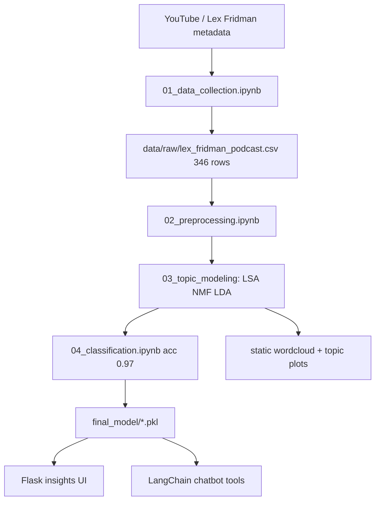

# AI Explains What They Meant — Podcast Emotion Insight Framework

### Lex Fridman transcript mining — LSA/NMF/LDA topics, emotion classification, Flask + LangChain UI

[](https://github.com/ArchanaChetan07/AI-Explains-What-They-Meant-An-Emotion-Insight-Mining-Framework-for-Podcasts/actions/workflows/ci.yml)
[](https://www.python.org/)
[](tests/test_ai_explains_what_they_mea.py)
[](app/)
[](#license)

End-to-end NLP framework for **Lex Fridman podcast transcripts**: collect 346 episodes, preprocess segments, run LSA/NMF/LDA topic models (5 topics each), train a text classifier, and serve insights through a **Flask** web app plus optional **Streamlit** and **LangChain** chat tools. No FastAPI or Prometheus stack is implemented in this repo.

---

## Key Results

| Metric | Value | Source |
|---|---|---|
| Podcast episodes (raw CSV) | **346** rows | `notebooks/01_data_collection.ipynb` output |
| Pipeline notebooks | **5** | `notebooks/01`–`05` |
| Python modules | **15** | `app/`, `langchain_chatbot/`, helpers |
| Topic models compared | **LSA + NMF + LDA** (5 topics each) | `notebooks/03_topic_modeling.ipynb` |
| Classifier test accuracy | **0.97** (68 samples) | `notebooks/04_classification.ipynb` output |
| Saved models | **2** (`classification_model.pkl`, `vectorizer.pkl`) | `final_model/` |
| Unit tests | **8** | `tests/test_ai_explains_what_they_mea.py` |
| Flask routes | **Yes** | `app/app.py`, `app/routes.py` |
| Docker | **Yes** | `Dockerfile` |
| BERTopic export | **1** CSV | `notebooks/prediction_output/bertopic_summary.csv` |

---

## Architecture



**How it works:** Notebooks ingest podcast metadata and transcript text, tokenize segments, fit TF-IDF + matrix factorization models, and train a sklearn classifier saved to `final_model/`. The Flask app renders topic word clouds, guest charts, and prediction routes; LangChain tools wrap guest search, topic prediction, and Wikipedia lookup.

---

## Tech Stack

| Layer | Choice |
|---|---|
| Language | Python 3.10+ |
| NLP | scikit-learn (LSA/NMF/LDA), NLTK, spaCy (in requirements) |
| UI | Flask + Jinja templates, Streamlit (`app_streamlit.py`) |
| Agents | LangChain chatbot tools |
| Viz | matplotlib, wordcloud |
| CI | GitHub Actions + pytest |

---

## Installation & Usage

```bash
git clone https://github.com/ArchanaChetan07/AI-Explains-What-They-Meant-An-Emotion-Insight-Mining-Framework-for-Podcasts.git
cd AI-Explains-What-They-Meant-An-Emotion-Insight-Mining-Framework-for-Podcasts
pip install -r requirements.txt
pytest tests/ -v
python -m flask --app app.app run   # or: python app/app.py
```

Run notebooks in order under `notebooks/` to reproduce data collection through Flask integration.

---

## Repository Layout

| Path | Purpose |
|---|---|
| `notebooks/` | 5-step pipeline (collect → preprocess → topics → classify → Flask) |
| `app/` | Flask UI, static plots, templates |
| `langchain_chatbot/tools/` | Guest search, topic predict, wiki tool |
| `final_model/` | Serialized classifier + vectorizer |
| `Transcripts/` | Per-episode transcript text files |

---

## License

See repository license file if present.
